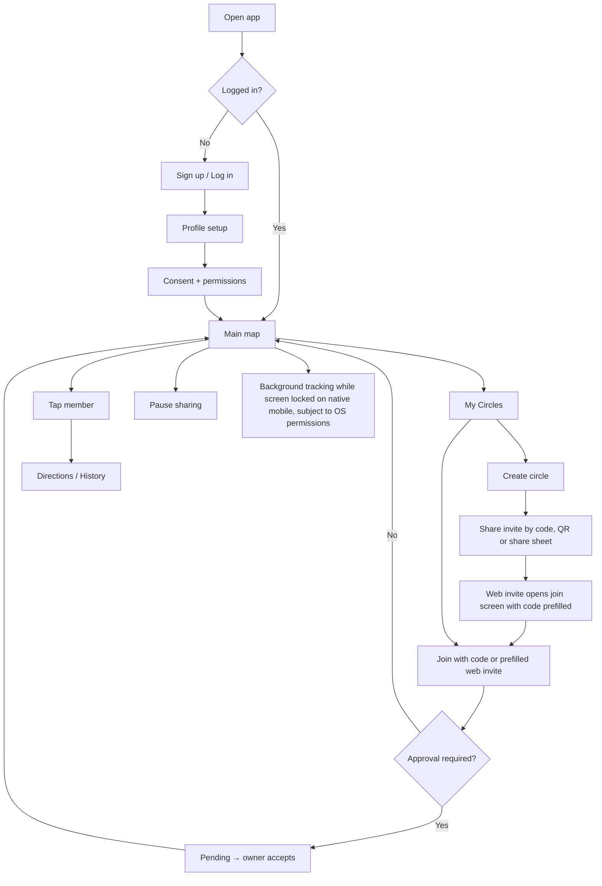
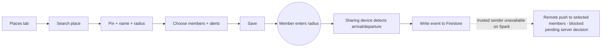
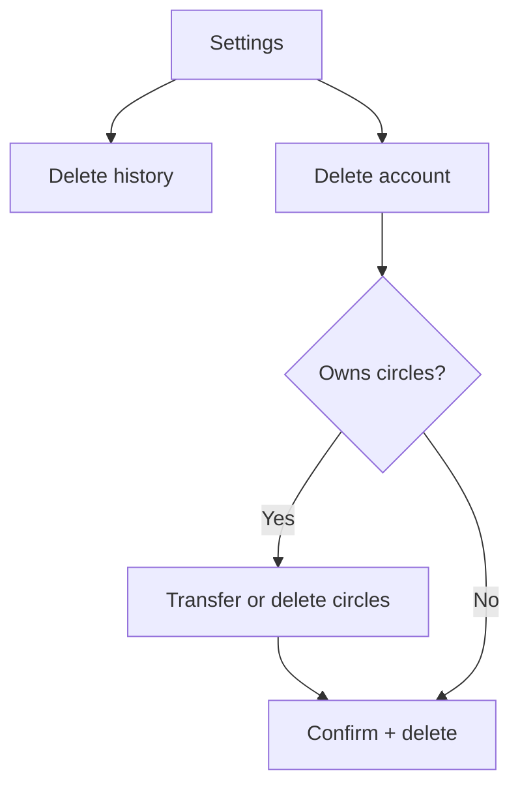

# User Flows

```mermaid
flowchart TD
  A[Open app] --> B{Logged in?}
  B -- No --> C[Sign up / Log in] --> D[Profile setup] --> E[Consent + permissions]
  B -- Yes --> F[Main map]
  E --> F
  F --> G[My Circles]
  G --> H[Create circle] --> I[Share invite by code, QR or share sheet]
  I --> I2[Web invite opens join screen with code prefilled] --> J
  G --> J[Join with code or prefilled web invite] --> K{Approval required?}
  K -- Yes --> L[Pending → owner accepts] --> F
  K -- No --> F
  F --> M[Tap member] --> N[Directions / History]
  F --> O[Pause sharing] 
  F --> P[Background tracking while screen locked on native mobile, subject to OS permissions]
```

```mermaid
flowchart LR
  P[Places tab] --> Q[Search place] --> R[Pin + name + radius] --> S[Choose members + alerts] --> T[Save]
  T --> U((Member enters radius)) --> V[Sharing device detects arrival/departure] --> X[Write event to Firestore] 
  X -. trusted sender unavailable on Spark .-> W[Remote push to selected members - blocked pending server decision]
```

```mermaid
flowchart TD
  X[Settings] --> Y[Delete history] 
  X --> Z[Delete account] --> AA{Owns circles?}
  AA -- Yes --> AB[Transfer or delete circles] --> AC[Confirm + delete]
  AA -- No --> AC
```
