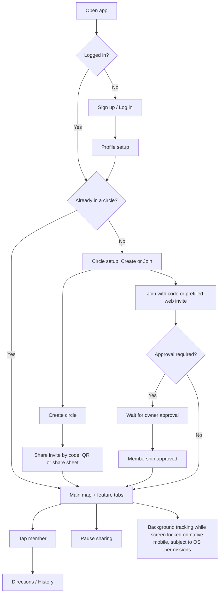
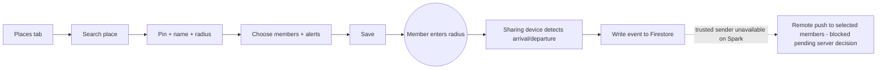
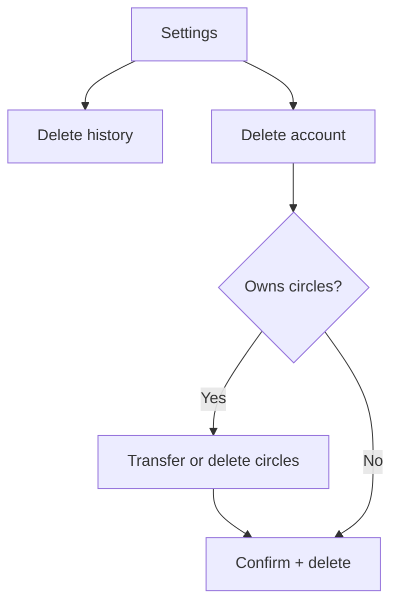

# User Flows

```mermaid
flowchart TD
  A[Open app] --> B{Logged in?}
  B -- No --> C[Sign up / Log in] --> D[Profile setup]
  B -- Yes --> E{Already in a circle?}
  D --> E
  E -- No --> F[Circle setup: Create or Join]
  E -- Yes --> M[Main map + feature tabs]
  F --> G[Create circle] --> H[Share invite by code, QR or share sheet] --> M
  F --> I[Join with code or prefilled web invite] --> J{Approval required?}
  J -- Yes --> K[Wait for owner approval]
  K --> L[Membership approved] --> M
  J -- No --> M
  M --> N[Tap member] --> O[Directions / History]
  M --> P[Pause sharing]
  M --> Q[Background tracking while screen locked on native mobile, subject to OS permissions]
```

```mermaid
flowchart LR
  P[Places tab] --> Q[Search place] --> R[Pin + name + radius] --> S[Choose members + alerts] --> T[Save]
  T --> U((Member enters radius)) --> V[Sharing device detects arrival/departure] --> X[Write event to Firestore] 
  X -. trusted sender unavailable on Spark .-> W[Remote push to selected members - blocked pending server decision]
```

```mermaid
flowchart TD
  X[Settings] --> Y[Delete history] 
  X --> Z[Delete account] --> AA{Owns circles?}
  AA -- Yes --> AB[Transfer or delete circles] --> AC[Confirm + delete]
  AA -- No --> AC
```
